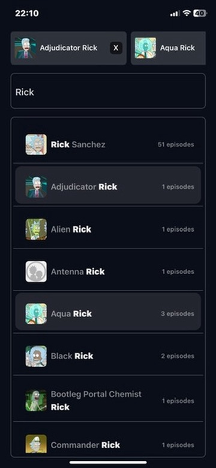
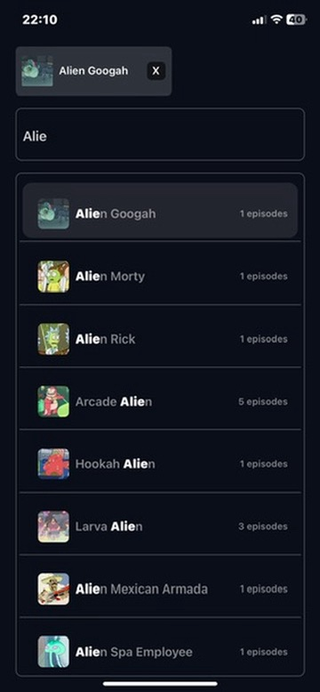
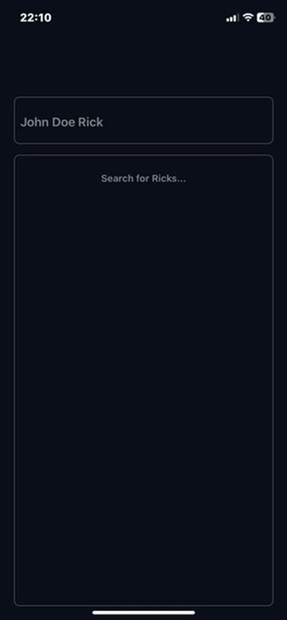

# Furkan Can React Native Assesment

This assessment was made by Furkan Can for mobile developer application.

## Packages used

- Nativewind
- Clsx
- Tailwind merge
- Expo Router
- Zustand
- Immer

## How does the application work?

It displays a list of characters that match the text entered in the search box. By clicking on the characters in the list, you can add and remove them from the selected characters section. The selected characters section is displayed on the search box.

## Screenshots

Here are some screenshots of the app:

## About Application

You can download and try the APK of the application from the link below.
[Download](https://dosya.co/5xh7iciej8h0/furkan_can_assesment_apk.zip.html)
